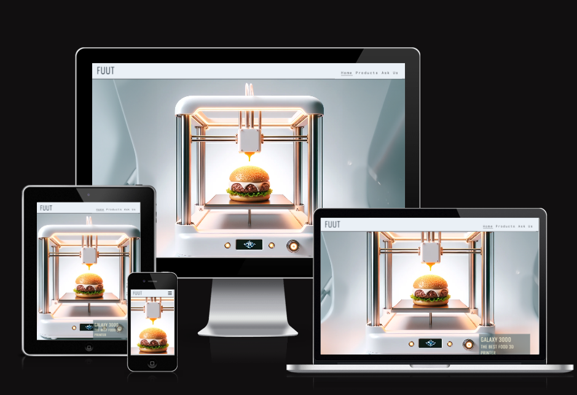
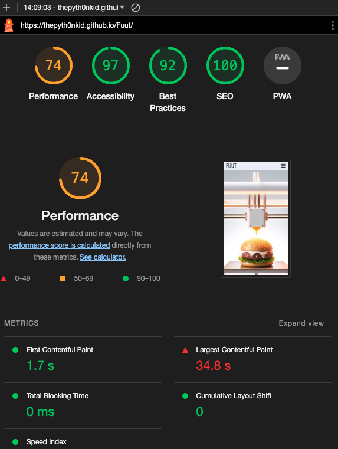
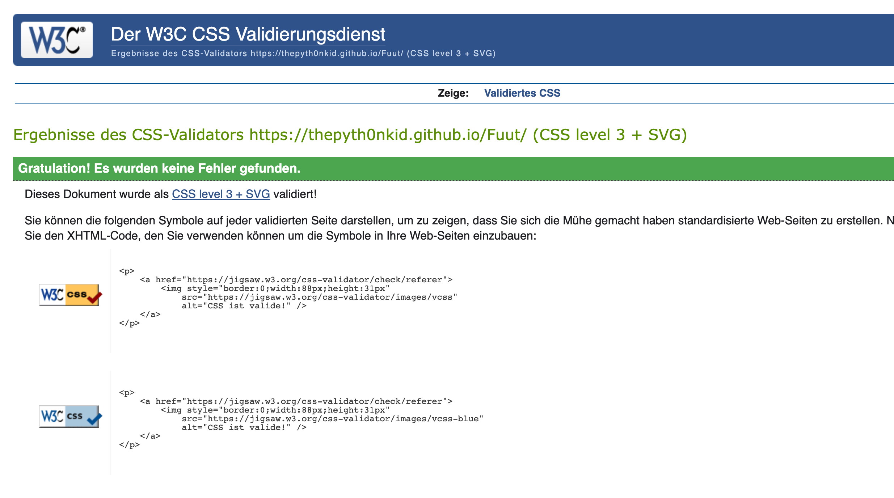
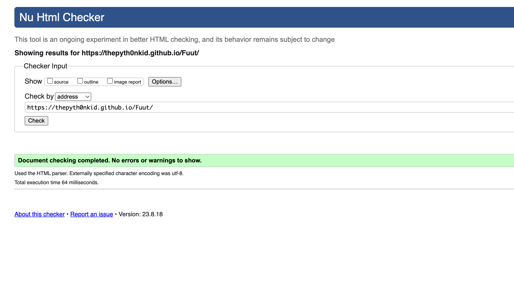

# Fuut

[Visit the Fuut website here](https://github.com/ThePyth0nKid/Fuut)

Fuut - Sustainable Fully Automated Food Innovation

About the Project

Created to inspire and inform individuals interested in the future of food technology; specifically those curious about sustainable and automated food innovations, as this is the main theme showcased on this website. This website was developed strictly for educational purposes.

### Key Features

- **Innovative Technology:** Fuut showcases the latest trends in food technology, demonstrating how automation and sustainability can be combined.
- **Visionary Focus:** The site presents a vision of the future of food, emphasizing the importance of sustainability in food production and the role technology can play in achieving this vision.
- **Fictional Company Profile:** While Fuut is a fictional company, it is presented on the site as if it were a real, leading entity in its field, offering visitors a realistic experience.

This website is made up of the following sections:

1. Home/High quality hero image
2. Why Fuut?
3. Our Products
4. Ask us

## Home/Introduction

The home section serves as an introduction to Fuut, a fictitious company that represents the pinnacle of sustainable, fully automated food technology. Explore the groundbreaking innovations that make Fuut a frontrunner in the industry.

## Why Fuut?

Discover the philosophy and vision behind Fuut's innovations. Understand why sustainability and automation are crucial in shaping the future of food. Dive into our commitment to the environment and our dedication to reshaping the culinary world.

## Our Products

From the "Galaxy 3000", the world's premier Food 3D Printer, to the "Fuuty", an autonomous food truck, explore the diverse range of products that Fuut offers. Each product is a testament to Fuut's dedication to blending technology, convenience, and sustainability.

## Ask Us

Have queries or wish to learn more? The "Ask Us" section provides a platform for visitors to reach out and get their questions answered. Dive deeper into the world of Fuut and join us in this culinary revolution.

## UX

---

### **Strategy**

Considering the core UX principles, I began by contemplating the strategy for this website, defining the target users and the features/technologies they would desire.

Fuut's target users are:
* Aged 25-50
* Technology enthusiasts and early adopters
* Individuals interested in sustainable and automated food solutions
* Households or businesses looking to modernize their culinary process

What these users would be looking for:
- Clear, concise, easy-to-find information
- Beautiful photos that provide inspiration

### **Structure**

This is a single-page website to allow for desired flow; the navigation bar at the top allows for users to easily move to whatever section of the site they are interested in or they can simply scroll through the information as it is displayed.

---

## Technologies Used

I have used several technologies that have enabled this design to work:

- [HTML](https://developer.mozilla.org/en-US/docs/Web/HTML)
  - Used as the basic building block for the project and to structure the content.
- [CSS](https://developer.mozilla.org/en-US/docs/Learn/Getting_started_with_the_web/CSS_basics)
  - Used to style all the web content across the project.
- [JavaScript](https://www.javascript.com/)
  - Used for the hover effect of the images.
- [Google Fonts](https://fonts.google.com/)
  - Used to obtain the fonts linked in the header, fonts used were Playfair and Cookie
- [Font Awesome](https://fontawesome.com/)
  - Used to obtain the social media icons used in the footer.
- [Google Developer Tools](https://developers.google.com/web/tools/chrome-devtools)
  - Used as a primary method of fixing spacing issues, finding bugs, and testing responsiveness across the project.
- [GitHub](https://github.com/)
  - Used to store code for the project after being pushed.
- [Git](https://git-scm.com/)
  - Used for version control by utilising the Gitpod terminal to commit to Git and Push to GitHub.
- [Gitpod](https://www.gitpod.io/)
  - Used as the development environment.

---

## Testing

### **Lighthouse**

Lighthouse is a feature of Google Chrome developer tools and is used to assess the performance of the website and its features.

### **HTML and CSS Validation**

I validated both my HTML and CSS.

---

## Deployment
